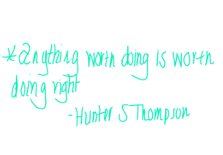

# The Clancy Protocol

**Emotional logistics. Creative AI scaffolding. Systems of survival, made scalable.**

---

## 🔍 What Is This?

**The Clancy Protocol** is a hybrid methodology and digital framework for designing systems of emotional logistics, digital sovereignty, and creative infrastructure.

Built by and for women in transition, it translates trauma-informed insight and artistic process into scalable, tech-enabled models.

---

## 🧰 Core Components

A hybrid methodology combining:

- **AI Scaffolding** — emotional modeling, prompt architecture, productivity scripting
- **Mental-Health-Informed UX** — clarity tools, decision fatigue reduction, burnout buffers
- **Creative Entrepreneurship** — monetization systems for digital products, services, and legacy work
- **Legacy Mapping** — organizing 10+ years of creative, personal, and professional assets into searchable, shareable structures

---

## ✨ Why It Matters

Because women in survival mode don’t need vague advice — they need infrastructure.  
Because creativity deserves context.  
Because no one builds the ark *after* the flood.

The Clancy Protocol helps creators metabolize chaos into clarity — with tools that hold space, not just data.

---

## 🧪 Use Cases

Examples of applied systems and outputs:

- **Digital Archive Structuring**: Turning scattered writing, audio, and fonts into monetizable assets  
- **Remote Work Scaffolding**: Tools to support neurodivergent, overextended professionals reclaiming workflow  
- **Creative Micro-Products**: Font bundles, prompt packs, Notion templates, and trauma-informed planning kits  
- **AI-Enhanced Support**: Journaling bots, CRM soundbite systems, decision maps using GPT logic

---

## 👥 Who It's For

- Women in transition or rebuilding post-crisis  
- Community-centered creatives and founders  
- Independent technologists and prompt engineers  
- Grantmakers and programs supporting ethical AI, healing, or social systems work

---

## 💸 Featured Project

🖋️ [Buy GonzoGirlScript on Gumroad](https://clancyprotocol.gumroad.com/l/emedp)  
📂 [Download GonzoGirlScript (.otf)](./GonzoGirlScript_OriginalType.otf)  
📄 [View License (.docx)](./GonzoGirlScript_Font_License.docx)  
🖼️ 

**GonzoGirlScript** is a digital font built from Clancy’s original handwriting — a raw, expressive typeface designed for creators, educators, and storytellers. It's part of a growing catalog of micro-products powered by The Clancy Protocol.

## 🧠 Authorship & AI Support

This project was conceptualized, authored, and directed by Clancy Wells using AI-assisted tools for drafting and formatting. While ChatGPT (Monday 8.0) supported markdown development and structural recommendations, all creative, conceptual, and editorial decisions remain under the sole direction of Clancy Wells.

The Clancy Protocol™ is an original work of emotional architecture and intellectual property. AI was used as a collaborator in execution — not a co-author of intent.

## 📌 Project Status

| Component | Status |
|----------|--------|
| GitHub repo | Active – README + framework documentation in development |
| Notion mirror | In progress – cross-referenced archive structure being built |
| Digital product listings | Launching – font + micro-offers live soon on Etsy, Gumroad, Creative Market |
| Legal + licensing | Registered copyright of protocol (June 1, 2025) |

---

## 🤝 Collaborate / Fund / Contact

For funding, collaboration, or press inquiries:  
📬 [the.clancy.protocol@gmail.com](mailto:the.clancy.protocol@gmail.com)

> *Even miracles need scaffolding.* This is the scaffolding.

---

## 🪪 License

© 2025 Clancy Wells. All rights reserved.  
This repository and its contents are protected. For licensing or usage inquiries, contact the author.
